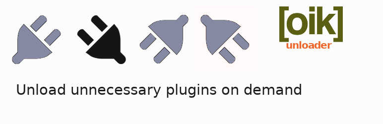

# oik-unloader 

* Contributors: bobbingwide, vsgloik
* Donate link: https://www.oik-plugins.com/oik/oik-donate/
* Tags: oik, plugin, unloader
* Requires at least: 5.8.1
* Tested up to: 5.8.1
* Stable tag: 0.0.0

WordPress Must Use plugin to unload unnecessary plugins on demand.

## Description 
Use the oik-unloader plugin to unload unnecessary plugins on demand.

Many websites have lots of plugins activated because the functionality is sometimes needed.
But quite a few of these plugins think they're needed all the time,
they do a lot of processing for each incoming request,
only to find that there's no need for the work that they've done.

These slow the server side processing of the site. This can increase time to first byte.
The plugins can also slow the front end of the site; delivering scripts, CSS and even HTML and images that are not actually needed.

Dynamically unloading a subset of plugins for certain requests could improve the overall performance of the site.

## Installation 
1. Upload the contents of the oik-unloader plugin to the `/wp-content/plugins/oik-unloader' directory
1. Activate the oik-unloader plugin through the 'Plugins' menu in WordPress
1. Visit the oik-unloader admin page
1. Use the admin interface to select which plugins to deactivate for selected URLs
1. Click on the link to activate/update the Must Use ( MU ) plugin
1. Disable the MU logic using the Deactivate link

* Note: In a WordPress Multi Site installation
- There will only be one version of the Must Use plugin ( oik-unloader-mu.php )
- There will be multiple index and component dependencies files; one of each per site.

## Frequently Asked Questions 

# What is this plugin for? 
It helps to reduce the number of activated plugins in your website.
It dynamically removes from the plugins list the unwanted plugins.

# Which plugins can I deactivate? 

For certain URLs you should be able to deactivate a whole host of plugins that aren't actually required for the front end.
You may find that some plugins are extremely well behaved and it won't make the slightest difference if they're left activated.

## Screenshots 
1. oik-loader admin page - plugins
2. oik-loader admin page - oik-loader-mu not activated
3. oik-loader admin page - oik-loader-mu activated

## Upgrade Notice 
# 0.0.0 
Prototype version developed as part of a performance improvement project.

## Changelog 
# 0.0.0 
* Added: Brand new plugin. includes/oik-unloader-mu.php will only be installed in mu-plugins if the folder exists.
* Tested: With WordPress 5.8.1 and WordPress Multi Site
* Tested: With Gutenberg 11.7 and different variations
* Tested: With PHP 8.0

## Further reading 
See also [oik-loader](https://github.com/bobbingwide/oik-loader) which adds plugins to the list of plugins to activate.

If you want to read more about oik plugins and themes then please visit
[oik-plugins](https://www.oik-plugins.com/)
